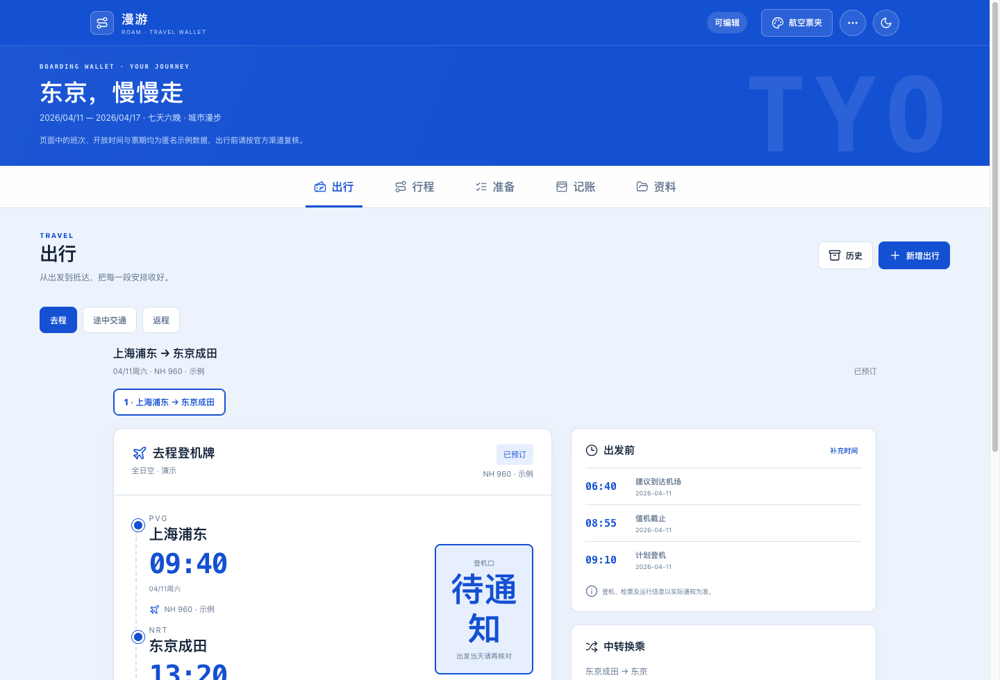
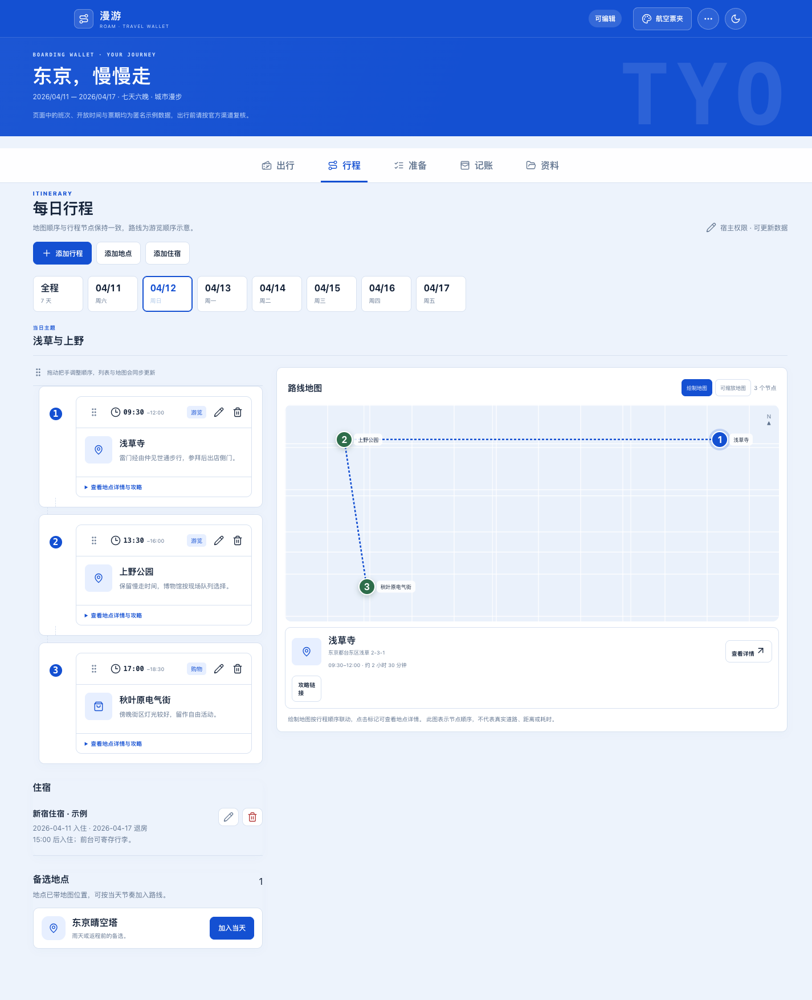
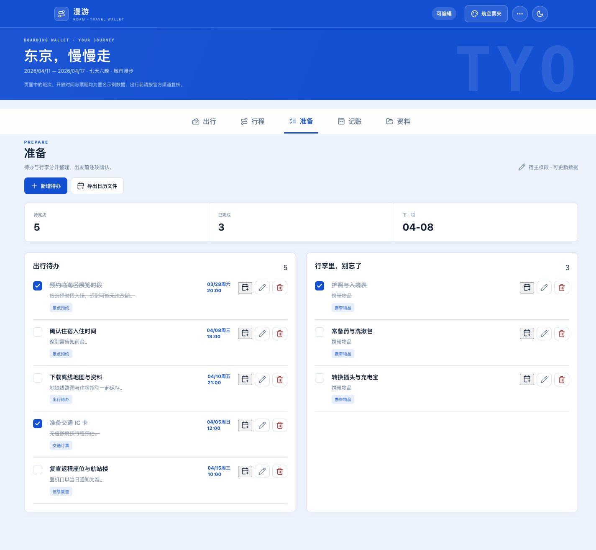
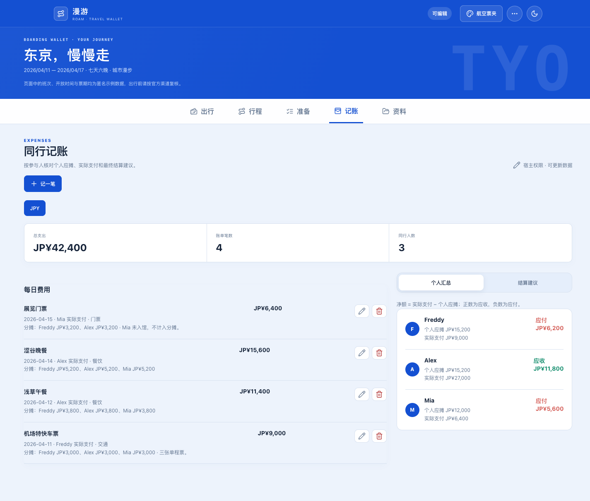
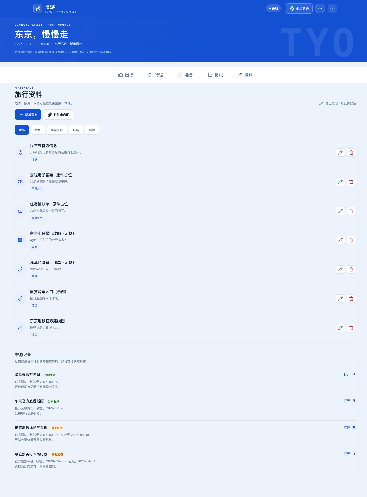
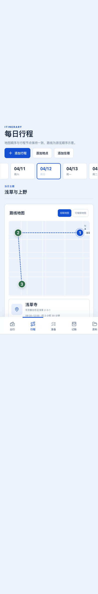
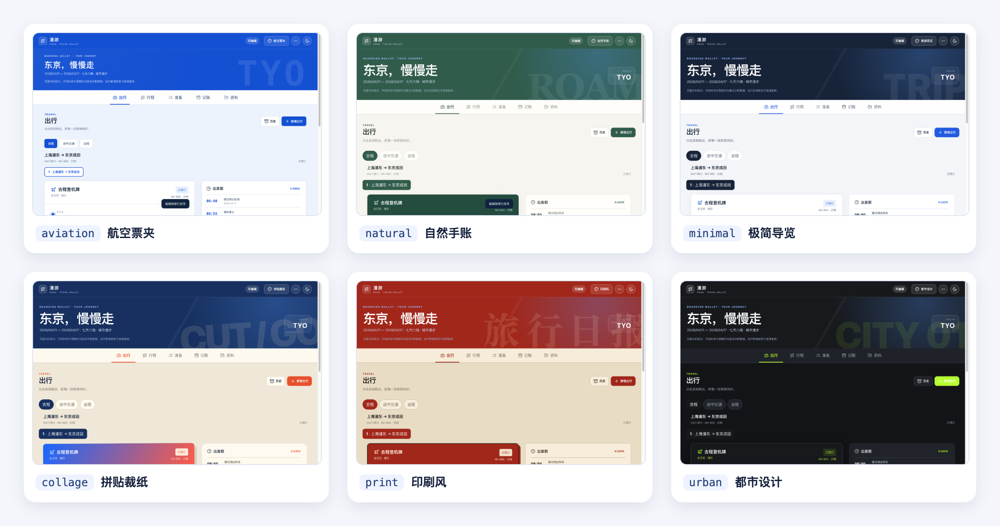

# WGX Travel Planning Skill

**From travel research to an editable travel workspace.**

Created and maintained by **Freddy Wang**

English · [中文](README.md)

---

## What it is

**WGX Travel Planning Skill** is a complete travel-planning Skill for AI agent environments.

It is not an independent Agent and does not define a Multi-Agent architecture. The host Agent handles conversation and tool usage, while this Skill provides the travel-specific workflow, data contracts, validation rules, product UI, deployment logic, and upgrade process.

It connects:

- preference discovery
- destination research
- route planning
- transport and stay organization
- UI style review
- TravelPack 1.1.0 generation
- deterministic validation
- editable five-module travel web app delivery
- read-only sharing
- map capability negotiation
- safe upgrades for existing deployments

The goal is not to generate another travel article. The goal is to create a **Personal Travel Workspace** that can be planned, edited, used, shared, and maintained throughout the trip lifecycle.

Current version: `1.0.0`  
Skill ID: `wgx-travel-planning`

> Migration-only compatible IDs: `hks-travel-skill`, `travel-guide-builder`.

---

## End-to-end workflow

```text
Travel request
  ↓
Preference confirmation
  ↓
Destination / POI / transport / stay / reservation research
  ↓
Regional plan and candidate places
  ↓
Day-by-day route draft
  ↓
Route confirmation
  ↓
Six-style UI review
  ↓
User-selected visual style
  ↓
TravelPack 1.1.0 generation
  ↓
Deterministic validation
  ↓
Host capability discovery
  ↓
Deployment authorization
  ↓
Editable five-module travel web app
  ↓
Real-browser acceptance checks
  ↓
Owner editing + read-only sharing
  ↓
Ongoing trip maintenance
  ↓
Safe future upgrades
```

---

## Supported environments

- **WorkBuddy**
- **Codex**
- Other **Skill-compatible AI environments**

---

# Core capabilities

## 1. Preference discovery

The Skill can structure constraints such as:

- destination
- dates
- origin / return location
- companions
- pace
- interests
- budget
- crowd tolerance
- transport constraints
- preferred stay areas
- food preferences
- driving requirements
- accessibility or family needs

Already-known information is not asked again. Before large-scale research begins, the Skill presents a preference summary for confirmation.

---

## 2. Destination research with freshness tracking

Research may cover:

- POIs
- regional relationships
- local movement cost
- intercity transport
- flights
- trains
- stay areas
- opening hours
- reservation rules
- ticketing rules
- seasonal conditions
- crowding
- duration estimates
- negative evidence and alternatives

Important sources can retain:

- platform
- title
- URL
- retrieval time
- verification time
- freshness class
- validity window
- current status

Dynamic information is not treated as permanent truth.

---

## 3. Executable itinerary planning

Instead of producing a list of attractions, the Skill organizes places into executable routes using:

- geography
- opening hours
- day length
- intercity movement
- transfer cost
- stay location
- preferred pace
- visit order
- reservation requirements

Formal itinerary items include:

- date
- place
- type
- start time
- end time
- order
- notes
- guide / restaurant / ticket links

---

## 4. Flight and transport organization

Structured `transportSegments` can represent:

- outbound travel
- return travel
- intercity travel
- flights
- trains
- buses
- other transport modes

Fields can include terminal, gate, airport arrival target, check-in cutoff, boarding time, departure / arrival times, status, tickets, and attachments.

Unbooked recommendations stay `planned` instead of being presented as confirmed reservations.

---

## 5. Map capability negotiation

The Skill separates:

1. Agent-side place / route data
2. WebService APIs
3. Web basemap rendering

It can discover available map MCPs, connectors, APIs, and host capabilities.

The generated product also includes a drawn-route fallback so itinerary navigation remains useful even when a web map SDK or key is unavailable.

---

# Six UI directions

The Skill uses real trip data for visual review before formal deployment.

| Style ID | Style |
|---|---|
| `aviation` | Aviation Wallet |
| `natural` | Natural Journal |
| `minimal` | Minimal Guide |
| `collage` | Collage |
| `print` | Editorial Print |
| `urban` | Urban |

`collage`, `print`, and `urban` are V4 preview directions currently reviewed first in the transport module before being expanded across the full product after user confirmation.

UI review must use a real HTTP(S) page or real browser screenshots.

---

# Five product modules

## 1. Transport

Manage outbound, return, and intermediate travel with flight / train / bus details, milestones, ticket material links, and attachment capability.

## 2. Itinerary

Day-by-day timeline, place details, guide links, route map, and mouse + touch drag reordering. Reordering updates the list, numbering, route lines, and drawn map consistently.

## 3. Checklist

Reservations, tickets, packing, weather checks, trip reminders, and other tasks. Tasks support pending / done states and calendar / ICS export when applicable.

## 4. Expense

Multi-person travel expense tracking with equal or custom splits, per-person totals, net receivable / payable values, and currency-separated settlement suggestions.

Malformed input — unknown companions, custom splits that do not add up, unsettled balances — is rejected by deterministic validation before it can reach the product, instead of being shown as a settlement result.

## 5. Materials

Organize places, tickets, guides, web links, hotel information, restaurant links, ticketing pages, and optional cloud-backed attachments.

---

# TravelPack 1.1.0

TravelPack separates AI research and reasoning from the travel product runtime.

Top-level collections include:

```text
appearance
trip
companions[]
days[]
places[]
itineraryItems[]
transportSegments[]
stays[]
tasks[]
expenses[]
materials[]
assets[]
sources[]
```

Before delivery, deterministic validation checks schema version, IDs, references, dates, time ranges, transport logic, URLs, expense splits, source structures, and sensitive-field boundaries.

---

# Editable cloud travel app

A full cloud delivery requires:

- the official five-module frontend
- persistent TravelPack read / write
- owner editing
- read-only sharing
- revision conflict handling
- reload persistence
- read-only write rejection
- optional shared attachment storage

The product is considered complete only when these product outcomes are actually available.

---

# Deployment routing

The Skill can adapt to:

- WorkBuddy
- Cloudflare
- Codex Sites
- generic agent / MCP adapters (static previews stay UI-review only and are never final delivery)
- other host environments with database, identity, and publishing capabilities

The decision is based on product outcomes rather than a fixed vendor stack.

---

# Safe upgrades for existing deployments

Existing travel sites can be upgraded through `travel-app-manifest.json`.

The upgrade flow protects:

- online TravelPack
- user edits
- completed tasks
- expenses
- attachments
- database
- domain
- share links
- permissions
- secrets

A backup with SHA-256 is created before the upgrade, and the deployment is re-verified afterwards. Pure code upgrades do not rewrite the live TravelPack.

---

# Product preview

> Screenshots come from real HTTP(S) pages and were checked for public-safe information. The demo data is an anonymous Tokyo trip.

## Product overview



## Itinerary and route map



## Checklist and calendar



## Expense and settlement



## Materials and guide links



## Mobile



## UI style overview

> `aviation` / `natural` / `minimal` cover the full five-module product; `collage` / `print` / `urban` are currently in the V4 transport-module preview stage.



---

# Installation

## WorkBuddy

```bash
git clone https://github.com/FreddyWang-02/wgx-travel-skill.git
cp -R wgx-travel-skill/wgx-travel-planning ~/.workbuddy/skills/wgx-travel-planning
```

Restart or refresh WorkBuddy, then invoke:

```text
$wgx-travel-planning
```

## Codex

```bash
git clone https://github.com/FreddyWang-02/wgx-travel-skill.git
cp -R wgx-travel-skill/wgx-travel-planning ~/.codex/skills/wgx-travel-planning
```

## Other compatible environments

Place `wgx-travel-planning/` in the host's documented Skills directory and keep the directory name aligned with the `name` field in `SKILL.md`.

---

# Example usage

```text
Use $wgx-travel-planning to plan a 9-day trip to Lijiang and Shangri-La.

Confirm my preferences first, then research destinations, transport, stays, and reservation requirements.
After I confirm the route, show the UI styles using real trip data.
Only deploy the editable travel app after I approve the visual style and deployment.
```

Upgrade an existing deployment:

```text
Use the latest WGX Travel Planning Skill to upgrade this site:

<site URL>

Preserve the database, user edits, attachments, share links, and domain.
Create a backup first and verify both owner editing and read-only access after the upgrade.
```

---

# Map notes

Map MCP, WebService API, and web basemap rendering are separate capabilities.

Credentials must be injected through host secrets, identity systems, or environment variables. Never place keys, cookies, verification codes, or access tokens in TravelPack, logs, screenshots, or public manifests.

---

# Project structure

```text
wgx-travel-skill/
├── wgx-travel-planning/
│   ├── SKILL.md
│   ├── agents/
│   ├── assets/
│   ├── references/
│   └── scripts/
├── docs/screenshots/
├── scripts/audit-public-tree.mjs
├── tests/
├── CHANGELOG.md
├── PRIVACY.md
├── SECURITY.md
├── THIRD_PARTY_NOTICES.md
└── README.md
```

---

# Development and checks

Node.js 20+ is required.

```bash
npm run audit
npm test
npm run check
```

---

# Privacy and security

Before public release, review:

- [PRIVACY.md](PRIVACY.md)
- [SECURITY.md](SECURITY.md)
- [Open Source Audit](docs/OPEN_SOURCE_AUDIT.md)

Production data, verification codes, browser state, local logs, cloud caches, keys, tokens, and cookies must stay out of the public repository.

---

# Third-party components

The frontend template currently includes:

- Leaflet 1.9.4
- Lucide 0.468.0

See [THIRD_PARTY_NOTICES.md](THIRD_PARTY_NOTICES.md).

---

# Maintainer

Maintained by **Freddy Wang**  
GitHub: [@FreddyWang-02](https://github.com/FreddyWang-02)

---

# License

[MIT License](LICENSE). Third-party components remain subject to their own licenses.
